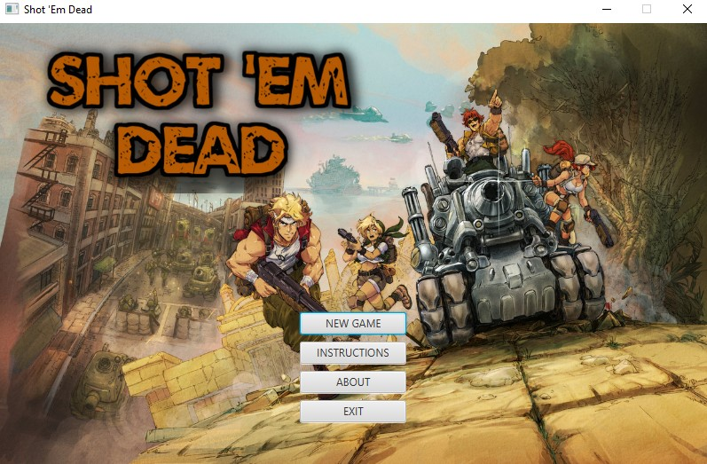
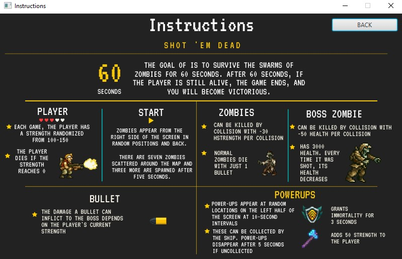
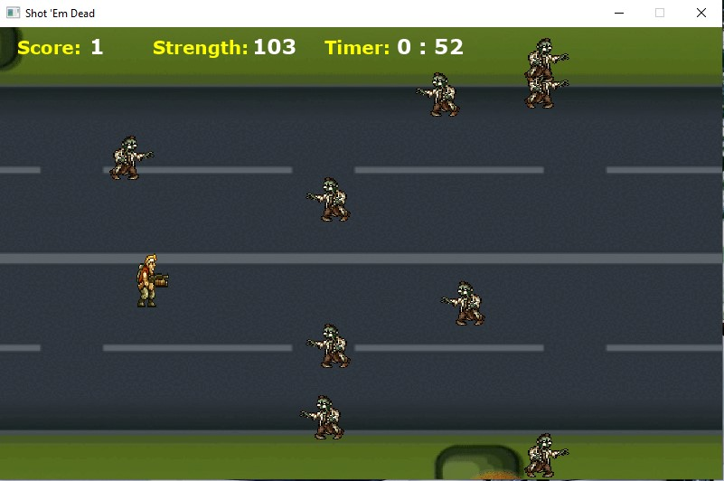
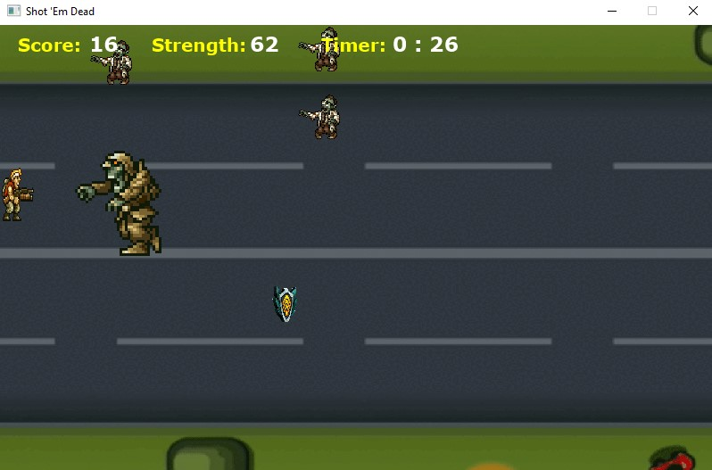
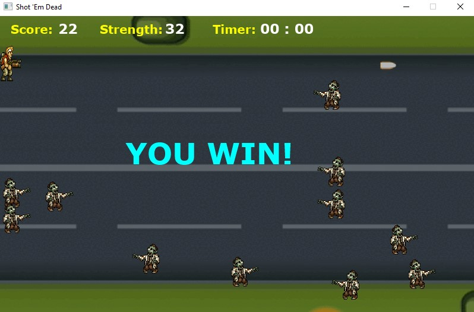
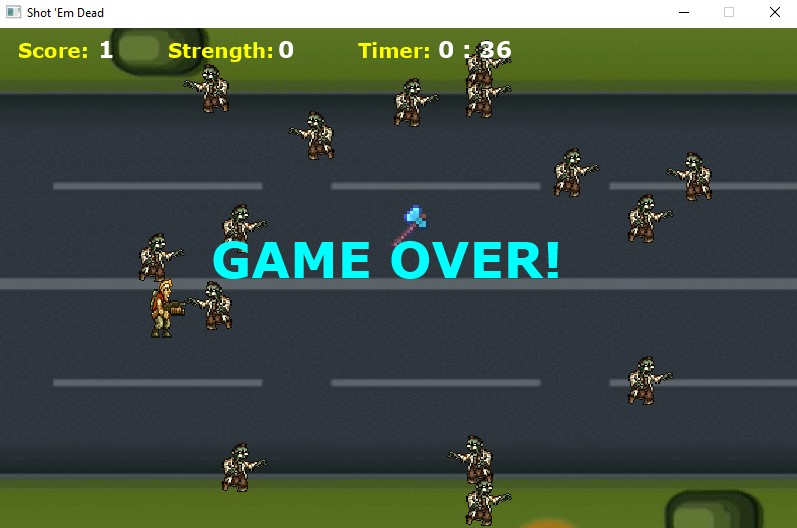

# Shot-Em-Dead
Collaborated with a partner to design and develop a shooting game implemented using Java and JavaFX. This was made as a final project for my CMSC 22 course.

### Screenshots

### Authors
Pineda, Brixter Sien
Mabaga, Apraem Cayle
